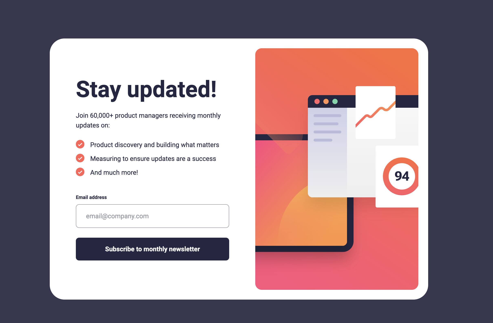

# Frontend Mentor - Newsletter sign-up form with success message solution

This is a solution to the [Newsletter sign-up form with success message challenge on Frontend Mentor](https://www.frontendmentor.io/challenges/newsletter-signup-form-with-success-message-3FC1AZbNrv). Frontend Mentor challenges help you improve your coding skills by building realistic projects. 

## Table of contents

- [Overview](#overview)
  - [The challenge](#the-challenge)
  - [Screenshot](#screenshot)
  - [Links](#links)
- [My process](#my-process)
  - [Built with](#built-with)
  - [What I learned](#what-i-learned)
  - [Useful resources](#useful-resources)
- [Author](#author)


## Overview

### The challenge

Users should be able to:

- Add their email and submit the form
- See a success message with their email after successfully submitting the form
- See form validation messages if:
  - The field is left empty
  - The email address is not formatted correctly
- View the optimal layout for the interface depending on their device's screen size
- See hover and focus states for all interactive elements on the page

### Screenshot




### Links

- [Solution URL](https://github.com/edpau/fm_newsletter-sign-up)
- [Live Site URL](https://edpau.github.io/fm_newsletter-sign-up/)

## My process

### Built with

- Semantic HTML5 markup
- CSS custom properties
- Flexbox
- Mobile-first workflow
- TypeScript


### What I learned

#### use background-image for the list-item 

```CSS
.card__list {
  list-style: none;
  padding-left: 0;
}

.card__list-item{
  padding-left: 2.2rem;
  background-image: url("../images/icon-list.svg");
  background-repeat: no-repeat;
  background-position: 0 0;
  background-size: 1.3rem 1.3rem;
}
```

#### Lazy DOM Querying
- This simple form validation does not need lazy dom querying
-  It is an approach that balances efficiency by querying the DOM only when the user triggers the relevant action.
-  Lazy DOM Querying: The toggleSuccessMessage function is now a closure that lazily queries the DOM the first time it’s invoked. This means the DOM elements are not fetched upfront and will only be queried when someone subscribes (or dismisses the success message).
-  First Time Querying: The first time the toggleSuccessMessage closure is called, it queries the DOM and stores the elements in variables. After that, it will reuse the stored elements without querying the DOM again.
-  Efficiency: This approach reduces wasteful querying when you expect fewer interactions but still avoids querying the DOM multiple times after the first interaction.

```JS
function toggleSuccessMessage() {
  let cardImg: HTMLImageElement | null = null;
  let cardContent: HTMLDivElement | null = null;
  let cardSuccess: HTMLDivElement | null = null;

  return function () {
    // Only query the DOM when the function is called for the first time
    if (!cardImg || !cardContent || !cardSuccess) {
      cardImg = document.querySelector(".card__picture") as HTMLImageElement;
      cardContent = document.querySelector(".card__content") as HTMLDivElement;
      cardSuccess = document.querySelector(".card__success") as HTMLDivElement;
    }

    if (cardImg && cardContent && cardSuccess) {
      cardImg.classList.toggle("hidden");
      cardContent.classList.toggle("hidden");
      cardSuccess.classList.toggle("hidden");
    } else {
      console.error("One or more elements for success message are missing");
    }
  };
}
```

### Useful resources

- [Styling lists](https://developer.mozilla.org/en-US/docs/Learn/CSS/Styling_text/Styling_lists) - taught me how to use background-image for the list-item.
- [Custom CSS Bullets with ::marker](https://www.svgbackgrounds.com/custom-css-bullets-with-marker/)
- [Client-side form validation](https://developer.mozilla.org/en-US/docs/Learn/Forms/Form_validation) - use JavaScript to take control over the look and feel of native error messages with the Constraint Validation API.


## Author

- Website - [Edward Pau](https://www.edpau.me)
- Frontend Mentor - [@edpau](https://www.frontendmentor.io/profile/edpau)
